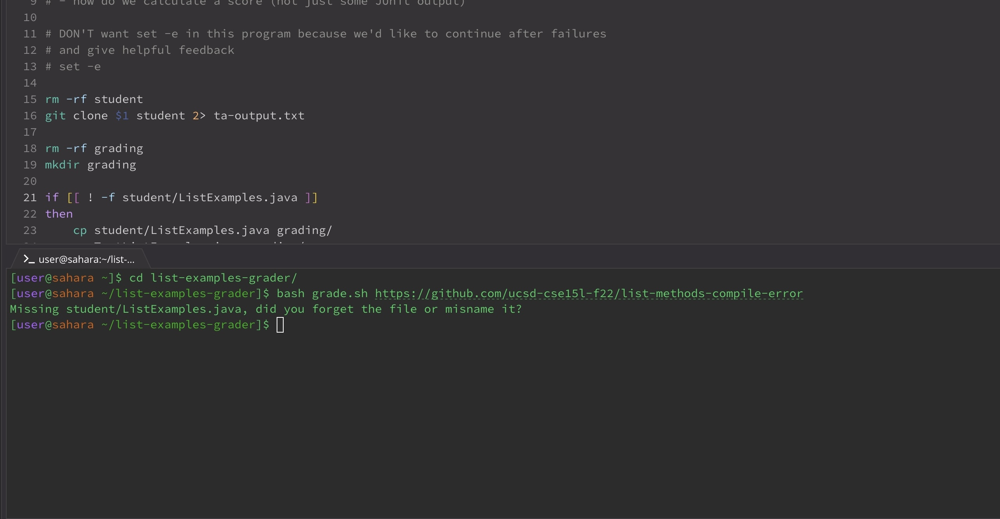

 Lab report 5
---
Student's Post
---
*Hi, I was looking back at the code from Wednesday's lecture and trying to 
run it myself. I ran with `bash grade.sh https://github.com/ucsd-cse15l-f22/list-methods-compile-error`,
but the output was not what I expected. The output looks like this:*

*Is there any reason for this?*


---
Reply
---
*Hi! This issue arises because your condition checks if the file`student/ListExamples.java`does not exist, instead of verifying its existence. The operator `!` introduces a logical error, resulting in incorrect output.*


---
Student's Reply
---
* Hi! Thank you! i have updated my code and it is working right now.*


---
The file & directory structure
---
`grade.sh`: shell script for the grading.
`GradeServer.java`: Java file grading server.
`TestListExamples.java`: Java file for ListExamples.java.
`server.java`: file for server setup.
`ta-output.txt`: a text file
`git-output.txt`: A text file*

---
The contents of each file before fixing the bug
---
`grade.sh`
```
rm -rf student
git clone $1 student 2> ta-output.txt

rm -rf grading
mkdir grading

if [[ ! -f student/ListExamples.java ]]
then
    cp student/ListExamples.java grading/
    cp TestListExamples.java grading/
else
    echo "Missing student/ListExamples.java, did you forget the file or misname it?"
    exit 1 #nonzero exit code to follow convention
fi

pwd
cd grading
pwd

CPATH='.:../lib/hamcrest-core-1.3.jar:../lib/junit-4.13.2.jar'
javac -cp $CPATH *.java

if [[ $? -ne 0 ]]
then
  echo "The program failed to compile, see compile error above"
  exit 1
fi

java -cp $CPATH org.junit.runner.JUnitCore TestListExamples > junit-output.txt

lastline=$(cat junit-output.txt | tail -n 2 | head -n 1)
tests=$(echo $lastline | awk -F'[, ]' '{print $3}')
failures=$(echo $lastline | awk -F'[, ]' '{print $6}')
successes=$((tests - failures))

echo "Your score is $successes / $tests"
```
---
`GradeServer.java`
```
import java.io.BufferedReader;
import java.io.IOException;
import java.io.InputStream;
import java.io.InputStreamReader;
import java.net.URI;
import java.net.URISyntaxException;
import java.util.Arrays;
import java.util.stream.Stream;

class ExecHelpers {

  /**
    Takes an input stream, reads the full stream, and returns the result as a
    string.

    In Java 9 and later, new String(out.readAllBytes()) would be a better
    option, but using Java 8 for compatibility with ieng6.
  */
  static String streamToString(InputStream out) throws IOException {
    String result = "";
    while(true) {
      int c = out.read();
      if(c == -1) { break; }
      result += (char)c;
    }
    return result;
  }

  /**
    Takes a command, represented as an array of strings as it would by typed at
    the command line, runs it, and returns its combined stdout and stderr as a
    string.
  */
  static String exec(String[] cmd) throws IOException {
    Process p = new ProcessBuilder()
                    .command(Arrays.asList(cmd))
                    .redirectErrorStream(true)
                    .start();
    InputStream outputOfBash = p.getInputStream();
    return String.format("%s\n", streamToString(outputOfBash));
  }

}

class Handler implements URLHandler {
    public String handleRequest(URI url) throws IOException {
       if (url.getPath().equals("/grade")) {
           String[] parameters = url.getQuery().split("=");
           if (parameters[0].equals("repo")) {
               String[] cmd = {"bash", "grade.sh", parameters[1]};
               String result = ExecHelpers.exec(cmd);
               return result;
           }
           else {
               return "Couldn't find query parameter repo";
           }
       }
       else {
           return "Don't know how to handle that path!";
       }
    }
}

class GradeServer {
    public static void main(String[] args) throws IOException {
        if(args.length == 0){
            System.out.println("Missing port number! Try any number between 1024 to 49151");
            return;
        }

        int port = Integer.parseInt(args[0]);

        Server.start(port, new Handler());
    }
}

class ExecExamples {
  public static void main(String[] args) throws IOException {
    String[] cmd1 = {"ls", "lib"};
    System.out.println(ExecHelpers.exec(cmd1));

    String[] cmd2 = {"pwd"};
    System.out.println(ExecHelpers.exec(cmd2));

    String[] cmd3 = {"touch", "a-new-file.txt"};
    System.out.println(ExecHelpers.exec(cmd3));
  }
}
```
---
`Server.java`
```
import java.io.IOException;
import java.io.OutputStream;
import java.net.InetSocketAddress;
import java.net.URI;

import com.sun.net.httpserver.HttpExchange;
import com.sun.net.httpserver.HttpHandler;
import com.sun.net.httpserver.HttpServer;

interface URLHandler {
    String handleRequest(URI url) throws IOException;
}

class ServerHttpHandler implements HttpHandler {
    URLHandler handler;
    ServerHttpHandler(URLHandler handler) {
      this.handler = handler;
    }
    public void handle(final HttpExchange exchange) throws IOException {
        // form return body after being handled by program
        try {
            String ret = handler.handleRequest(exchange.getRequestURI());
            // form the return string and write it on the browser
            exchange.sendResponseHeaders(200, ret.getBytes().length);
            OutputStream os = exchange.getResponseBody();
            os.write(ret.getBytes());
            os.close();
        } catch(Exception e) {
            String response = e.toString();
            exchange.sendResponseHeaders(500, response.getBytes().length);
            OutputStream os = exchange.getResponseBody();
            os.write(response.getBytes());
            os.close();
        }
    }
}

public class Server {
    public static void start(int port, URLHandler handler) throws IOException {
        HttpServer server = HttpServer.create(new InetSocketAddress(port), 0);

        //create request entrypoint
        server.createContext("/", new ServerHttpHandler(handler));

        //start the server
        server.start();
        System.out.println("Server Started! Visit http://localhost:" + port + " to visit.");
    }
}
```
---
`TestListExamples.java`
```
import static org.junit.Assert.*;
import org.junit.*;
import java.util.Arrays;
import java.util.List;

class IsMoon implements StringChecker {
  public boolean checkString(String s) {
    return s.equalsIgnoreCase("moon");
  }
}

public class TestListExamples {
  @Test(timeout = 500)
  public void testMergeRightEnd() {
    List<String> left = Arrays.asList("a", "b", "c");
    List<String> right = Arrays.asList("a", "d");
    List<String> merged = ListExamples.merge(left, right);
    List<String> expected = Arrays.asList("a", "a", "b", "c", "d");
    assertEquals(expected, merged);
  }
  @Test(timeout = 500)
  public void testMergeLeftEnd() {
    List<String> left = Arrays.asList("a", "b", "d");
    List<String> right = Arrays.asList("a", "c");
    List<String> merged = ListExamples.merge(left, right);
    List<String> expected = Arrays.asList("a", "a", "b", "c", "d");
    assertEquals(expected, merged);
  }
}
```

--- 
`git-output.txt`
```
Cloning into 'student'...
```

---
`ta-output.txt`
```
Cloning into 'student'...
```
